# 02 — UX: information architecture, screens, interaction, visual system

Practice is a professional tool used in short bursts on a phone and in one longer desk session a week. The design optimises for time-to-first-useful-action, low decision cost per item, and a clear sense of being done.

## Information architecture

Four tabs plus one global compose action. Cadence drives the structure (see `01-scenarios.md` → Rhythms): daily work lives in **Today**, per-person work in **Clients**, reusable material in **Library**, and the business in **Practice**. Weekly review is not a fifth tab; it is a section of Today that becomes prominent on review days and is always reachable from a client.

```mermaid
flowchart TD
  T[Today] --> T1[Needs you]
  T --> T2[New meals]
  T --> T3[Quiet]
  T --> T4[Reviews due]
  T --> T5[Labs to confirm]
  T2 --> MR[Meal review sheet]
  T4 --> RC[Weekly review composer]

  C[Clients] --> H[Household]
  H --> HT[Household day timeline]
  H --> M[Member]
  M --> MD[Day]
  M --> MW[Week]
  M --> ML[Labs]
  M --> MP[Plan]
  M --> MN[Notes]
  C --> NH[New household / invite]

  L[Library] --> LS[Swaps]
  L --> LN[Nudge templates]
  L --> LF[Focus templates]
  L --> LP[Programme defaults]
  L --> LL[Lab panels]

  P[Practice] --> P1[Profile and invite]
  P --> P2[Team and roles]
  P --> P3[Review windows and quiet hours]
  P --> P4[Notifications]
  P --> P5[Analytics]
  P --> P6[Export and legal]

  X((Compose +)) --> X1[Note]
  X --> X2[Message]
  X --> X3[Swap]
  X --> X4[Log meal for a client]
  X --> X5[Add lab report]
  X --> X6[Schedule call]
```



### Route map (Expo Router)

```
app/
  (auth)/sign-in, register, forgot-password      # reuse client app auth screens and Supabase flow
  (setup)/profile, invite                        # first run: display name, credentials, invite code + QR
  (tabs)/_layout
  (tabs)/index                                   # Today
  (tabs)/clients
  (tabs)/library
  (tabs)/practice
  meal/[eventId]                                 # Meal review (modal sheet on phone, right pane on wide)
  household/[householdId]                        # Household (timeline + members)
  household/[householdId]/new                    # New household / invite flow (multi-step)
  member/[memberId]/(day|week|labs|plan|notes)
  review/[householdId]                           # Weekly review composer
  library/(swaps|nudges|focus|programmes|labs)/[id]
  compose                                        # Compose sheet (+)
  practice/(profile|team|hours|notifications|analytics|export)
```

Wide layouts (tablet, web ≥ 900 px) render `(tabs)` as a left rail and open `meal/*`, `member/*`, `review/*` in a right detail pane instead of pushing a screen.

## Navigation and global patterns

- **Default action on swipe.** In every list of reviewable items, swipe right performs the item's default action (ack with the member's most-used positive tag), swipe left flags for weekly review. Both show a 5-second undo toast.
- **Auto-advance.** After any action in the meal review sheet, the next item in the same queue slides in. A "Stop here" affordance is always visible.
- **Predictable landing.** Every send action shows a one-line footer: "Priya sees this on her meal card and gets one notification at 09:00." Never send blind.
- **Voice everywhere text is.** Every text field has a mic; transcription goes through the existing `/ai/transcribe` route. Dictated text is editable before send.
- **Two-tap rule.** Any action on a meal, a member, or a household is at most two taps from Today.
- **Undo, not confirm.** Destructive confirmations only for revoking access, deleting a household, or ending an enrolment.
- **Offline.** Actions queue locally with a small "3 queued" pill in the tab bar; the queue replays on reconnect, oldest first, with conflicts surfaced (a meal acked by the assistant meanwhile shows both acks, latest visible to the client).

## Screens

Each screen lists purpose, layout, components, states, interactions, and example copy. Copy is a starting point in the nutritionist's voice and is template-driven in the Library so she can change it.

### Today

**Purpose.** Turn the stream into a prioritised, finite list and get her to zero.

**Layout.** Header, then fixed-order sections. Empty sections collapse to nothing; the order never changes so muscle memory works.

Header:
- Greeting with the current review window ("Morning window · 07:30–08:30") or "Between windows" in muted text.
- Time budget: "14 items · about 11 min", computed from her median seconds per action type over the last 30 days.
- Date, with a small chevron to view yesterday's queue as a read-only log.

Sections:
1. **Needs you** — client questions ("help me choose"), unanswered "who ate this" older than 30 min, meals flagged by the assistant, consent or join events that need acknowledgement. Never collapsed.
2. **New meals** — grouped by household, newest first within the group. After the first three cards in a household, the rest collapse behind "+4 more from Priya's household · Ack all as Good plate". Groups from households with a "Needs you" item sort first.
3. **Quiet** — members past their silence threshold. Card shows name, "Quiet since Tue 13:10", context from Plan ("travelling this week"), the ladder step, and the suggested template as a primary button. Secondary: "Snooze until Sunday".
4. **Reviews due** — appears from Saturday evening until all reviews are sent; otherwise a single-line "Next reviews Sunday". Card: "12 households · 3 done · about 35 min" → composer.
5. **Labs to confirm** — OCR'd reports awaiting confirmation.

Meal card (compact, 112 px):
- Left: photo thumbnail 88×88 with rounded corners. Tapping opens the review sheet. Long-press previews full-size.
- Title row: member name and, when proxy-logged, "· by Priya". Relationship chip for older adults ("Rajesh · 67").
- Meta row: "07:12 · Breakfast" and context chips: Home / Restaurant / Mess / Canteen, "Oil 1 tsp", "Oil?" when unconfirmed (amber, tappable → Ask).
- Caption in quotes, one line, truncated.
- Model line in muted text: "Poha, chai (catalog)" or "Rice, dal, sabzi, curd (visual · confirm)". No calories.
- Right edge: swipe affordance; a small dot if this member has an active focus this week, with the focus statement on long-press.

States:
- Loading: skeleton cards, header budget shows "…".
- Empty (all sections): a centred "All caught up." with the next window time and, on Fri/Sat, "Look ahead: 12 reviews due Sunday". No confetti; a quiet check.
- Error: inline banner "Couldn't refresh. Showing 07:31 snapshot." with retry; queue remains actionable offline.
- Assistant present: items already acked by Meera show her initial on the card; Ananya sees them under a collapsed "Reviewed by Meera (9)".

Interactions:
- Pull to refresh; background refresh every 30 s while the screen is visible (API poll in MVP; Realtime later).
- Swipe right: default ack. Swipe left: flag. Tap: review sheet. Long-press photo: peek.
- "Ack all as Good plate" per household group after at least one card in the group has been opened (prevents blind batch acks).

Copy:
- Time budget: "11 meals · about 9 min"
- Quiet card: "Aman · quiet since Tue 13:10 · travel week"
- Zero state: "All caught up. Next window 21:00."

### Meal review sheet

**Purpose.** Look properly, say one useful thing, move on.

**Layout (phone).** Bottom sheet at 92 % height over Today; drag down to dismiss. Photo takes the top 45 % with pinch-zoom and a "Compare with yesterday" thumbnail strip along the bottom edge of the photo (same member, same slot, last 3 days). Below: details block, then action bar, then the composer.

Details block:
- "Rajesh · Breakfast · 07:12 · logged by Priya via WhatsApp"
- Context chips (tap any to change; changes are recorded as nutritionist corrections).
- Caption.
- "What the model saw": a list of items with portion ("2 roti · dal 1 katori · rice ½ plate") from `signals`; an edit pencil opens an item/portion editor (roti count stepper, katori fill, oil tsp). Editing marks the event `reviewed` and stores the correction as ground truth.
- **Show estimate** (collapsed): range, assumptions, "restaurant widens the high end until oil is confirmed". Toggle "include with reply".
- This week for this member: a row of the last 7 ack tags as tiny chips so she does not repeat herself.

Action bar (horizontally scrollable ack chips, member-specific set, most-used first):
- Programme-general: Good plate · More protein next time · Watch the oil · Smaller portion · Add veg or fibre · Nice swap · Late meal · Sweet — swap it
- Timing/presence (older adults): Good timing · Protein present · Too late
- Each chip is one tag from `ackTagSchema`; the visible label is the nutritionist's template for that tag.

Secondary actions (icon row): **Comment** (text/voice) · **Swap** (Library picker) · **Ask** (structured question) · **Flag** (for Sunday) · **Note** (private, nutritionist-only) · **Move** (change subject member or slot).

Composer: single field, mic on the right, "Send" becomes "Send + next" once anything is entered. Footer: "Priya sees this on the meal · one notification at 09:00".

Ask (structured question) options: Where was this? · Extra oil or ghee? · How much did you eat? · Who was this for? · Anything else on the plate? Each renders as buttons in the client app and on WhatsApp.

Navigation: prev/next arrows in the sheet header show position ("4 of 11"); swiping the details block left/right moves between items.

States:
- Photo missing (text-only log): a neutral plate illustration with the caption large.
- Media still downloading from WhatsApp: shimmer with "Photo arriving".
- Already reviewed by the assistant: Meera's ack shown with "Add yours" or "Replace".

### Clients

**Purpose.** Find a household fast and see who needs attention without opening anything.

**Layout.** Search field, filter chips (All · Needs attention · Quiet · Review due · Labs due · Ending soon · Waiting to join · cohort names), sort (Attention first · Name · Programme day), then household cards. "+ New household" is a persistent button in the header.

Household card (96 px):
- Household name; member avatars (initials) with a tiny programme colour ring.
- "Day 23 of 90" progress hairline.
- Last log: "2 h ago" (Priya) · "yesterday" (Rajesh).
- 7-day consistency dots per member (filled = ≥ 2 meals logged that day, half = 1, empty = 0, dash = declared fasting/travel).
- State chip, one only, by priority: Needs you · Quiet 2 d · Review due · Labs due · Ending in 9 d · Waiting to join · On track.

States: empty ("No households yet. Create one or share your invite code."), search-no-results, and a "Waiting to join" group at the bottom for invites not yet redeemed with a resend action.

### Household

**Purpose.** See the family's day as one picture; manage the shared things (numbers, who-logs-for-whom, invite, programme dates).

**Layout.** Header: name, Day X of 90, cohort chip, overflow menu (Rename, Manage members, Rotate invite, End programme). Segmented control: **All** · Priya · Rajesh · Ira.

**All → Household day timeline.** A grid: rows = members, columns = Breakfast · Lunch · Snack · Dinner. Cells hold a thumbnail (tap → review sheet) or a dashed empty slot; a small "by P" corner mark on proxy-logged cells. A date strip above (7 days) moves the grid. Late meals sit in the Dinner column with a clock badge. Below the grid: household-level items — shared note field, "Message the household" (renders per member), linked WhatsApp numbers with default subject, the proxy matrix ("Priya logs for: Rajesh, Ira"), invite code and QR, intake checklist until complete.

Member segments → Member screen (below) embedded.

States: waiting to join (grid greyed, invite card prominent), programme ended (read-only banner with "Renew" / "Graduate"), consent limited (a lock on the tabs she cannot open).

### Member

Tabs: **Day** · **Week** · **Labs** · **Plan** · **Notes**. Header shows name, age, programme, current focus statement, and consent scopes as small lock icons when missing.

**Day.** Vertical timeline for the selected date: each meal with photo, context, caption, model line, and the ack tags and comments already sent. Empty slots show "No lunch logged" with **Log for Rajesh** (creates a `nutritionist` channel event) and **Ask**. Day note at the bottom (private). Date strip at top.

**Week.** The pattern view. Four blocks:
1. Consistency: 7 dots, "18 of 21 slots", streak, and the week-over-week arrow.
2. Patterns (auto-computed, plain sentences, each tappable to the meals behind it): "Dinner after 21:30 on 4 of 7 days" · "Restaurant meals: 2" · "More protein tagged 3 times, all at lunch" · "Quiet on Saturday" · "Extra oil confirmed on 2 photos". Rules live in the backend rollup; the UI just renders sentences with counts.
3. Focus: this week's statement and progress ("Dinner by 21:00 · 2 of 4 nights"), with last week's outcome underneath.
4. Shared measurements (if consented): weight trend sparkline with the last three points; steps if the client syncs them. No calorie totals unless "Show estimates" is on in Practice → Preferences.

"Start review" button at the bottom opens the composer for this household with this member first.

**Labs.** Timeline of reports (Intake · Day 45 · Day 90). Table view: analyte rows × report columns with units, reference range shading, and delta arrows. **Add report** → photo/PDF picker → OCR confirmation screen (each proposed value editable, unrecognised lines listed for manual entry) → tag as intake/mid/final. From a final report: **Create milestone** (choose analyte, preview badge, send). **Physician summary** exports a one-page PDF. Locked with an explanation if the `labs` scope is not granted.

**Plan.** Programme (PCOS / Diabetes / Thyroid / Gut / General) with "Change"; targets as a list of rule cards by kind — macro ("Protein ≥ 70 g"), timing ("Dinner before 21:00"), presence ("Protein at every meal"), avoid ("No sugar in chai") — each editable, each with a toggle "show to client under the camera"; dos/don'ts inherited from the programme with per-member edits; current and past focuses; swaps sent with tried/not/no answer; upcoming events (add: wedding, travel, festival, fasting, illness; dates; note to client optional).

**Notes.** Private notes (never visible to the client; audit-logged on read for assistants), consult log (calls with date, duration, and a dictated summary), intake summary (goals, history, allergies, medication as stated by the client), and the thread of visible messages for reference. A filter chip toggles Private / Visible / All.

### Weekly review composer

**Purpose.** Twelve personal reviews in under an hour, each with one measurable focus.

**Layout.** Progress header "3 of 12 households · Priya's household · 2 members". Then one member at a time:
1. **Facts** — chips generated from the rollup (the same sentences as Week → Patterns), each toggleable to include in the message.
2. **Went well** — pre-filled from positive tags and completed focus; editable.
3. **One thing for next week** — focus template picker ranked by patterns, or free text with a target picker (times per week / a time of day / a count). Exactly one focus; the UI resists adding a second ("One focus lands better. Save the other for next week." with a "Park it" option that stores it privately).
4. **Message** — drafted from her digest template + selected facts + focus, in her voice; dictate edits; **Preview as Priya** renders the client's Today focus card and the WhatsApp text.
5. **Send** → next member → next household. **Skip for now** keeps it in Reviews due.

Household-level step at the end of each household: one optional shared line ("Great week as a family — the early dinners showed up on everyone's plates.").

States: nothing logged this week (facts show "No meals logged · quiet since Tue"; draft focuses on getting back, offers the call), consent limited (facts omit locked scopes), assistant drafts (Meera can prepare; Ananya sends).

### New household / invite

Multi-step sheet, savable at any step:
1. Household name and members (name, relationship, age band). Max 4 in the UI; the API allows 3 extras plus self.
2. WhatsApp numbers per member and who-logs-for-whom (matrix; default all-for-all for 2–3 people).
3. Programme and targets per member (defaults from Library → Programme defaults; edit inline).
4. Intake lab panel per member (defaults by programme and age; toggle analytes).
5. Consent defaults (meals, profile, labs, messages) and the sentence the client will see.
6. Share: household code, QR, and a WhatsApp share sheet with a prefilled message and deep link (`adaptive-food-coach://join?h=CODE&n=CODE`). Also "Send by SMS/email".

After share, the household shows "Waiting to join" until first sign-in or first WhatsApp photo, with "Resend invite" and "Log their first meal myself".

### Library

Tabs: **Swaps** · **Nudges** · **Focus** · **Programmes** · **Lab panels**. Everything here is hers, optionally shared with her team. Seeded with a starter set on first run.

- **Swaps.** Card: name, one-line why, when to use (slump after lunch, late dinner, eating out), programmes, diet (veg/egg/non-veg/Jain), prep time, optional photo. Create from scratch or **from a meal** ("Save this plate as a swap") in the review sheet. Usage count and "tried" rate shown.
- **Nudges.** Templates with variables: `{name}`, `{quiet_days}`, `{last_meal}`, `{event}`. Per ladder step (24 h / 48 h / 72 h). Tone preview with a sample client.
- **Focus.** Statements with a target type (n days of 7 · before a time · count per day) and the pattern that triggers them. The composer ranks these.
- **Programmes.** PCOS / Diabetes / Thyroid / Gut / General: default targets, dos/don'ts (initially from the client app's `constants/programs.ts`), default ack chip set, default lab panel, default consent scopes. Editing here changes defaults for new members only.
- **Lab panels.** Intake (HbA1c ≥ 25 y, TG, LFT, KFT, lipids), conditional (fasting insulin for PCOS/T2D), 90-day repeat, and a custom builder over the analyte list.

### Practice

- **Profile and invite.** Display name, credentials, photo, one-paragraph bio (shown on the client's "Your nutritionist" screen), invite code with QR and rotate.
- **Team.** Invite by email; roles Owner / Dietitian / Assistant; scope toggles per role (Notes, Labs); per-member attribution on/off for client-visible replies.
- **Review windows and quiet hours.** Two windows by default; shown to clients ("Ananya reviews at 08:00 and 21:00"). Quiet hours suppress outbound notifications from Practice (queued to the next window).
- **Notifications.** Realtime for Needs you; batched to windows for New meals; daily digest option; per-cohort overrides.
- **Analytics.** Active households; minutes per household per week (from action timestamps); median ack latency; % meals acked within window; quiet members trend; 7-day consistency distribution; reviews sent on time. Range picker. This is the page she uses to decide whether to take the next batch.
- **Export and legal.** CSV per household (meals, tags, messages, labs with consent), account deletion, terms, and the data-processing statement clients see.

### Compose (+)

A sheet with six actions, each asking "For whom?" first (recent members on top, search below):
Note · Message · Swap · Log meal for a client · Add lab report · Schedule call. Selecting a member pre-scopes the action.

## Notifications (to the nutritionist)

| Event | Default | Rationale |
| --- | --- | --- |
| Client question / help me choose | Realtime | Time-sensitive; often at a restaurant |
| Who ate this unresolved 30 min | Realtime, quiet hours respected | Prevents mis-attributed meals |
| New meal | Batched to window | Protects her attention; clients are told the windows |
| Client went quiet | Once at threshold | No repeated pings |
| Lab report uploaded | Batched | Not urgent |
| Consent change / revoke | Realtime | Trust; affects what she can see |
| Reviews due | Saturday 18:00 and Sunday 18:00 | Plan the session |

## Wide layout (tablet, web)

- Left rail with the four tabs; middle column is the list (Today queue or Clients); right pane is the detail (meal review, member, composer). Selection persists across list refreshes.
- Keyboard: `J`/`K` next/previous item, `1`–`8` ack chips in displayed order, `C` comment, `S` swap, `A` ask, `F` flag, `N` private note, `Enter` send + next, `Z` undo, `/` search.
- Photo pane supports side-by-side compare (today vs the member's last three of that slot).
- The weekly review composer shows facts on the left and the draft on the right.

## Visual system

Reuse the client app's tokens (`constants/tokens.ts`: colours, radii, spacing, type scale, shadows) so the two apps read as one family. Then adapt for a professional tool:

- **Density.** Compact rows (meal card 112 px, household card 96 px); 16 px horizontal padding; lists over cards.
- **Palette.** White canvas and `card` surfaces; text `textPrimary`/`textMuted`; `primary` blue only for actions. Status colours are semantic and used sparingly: attention `accentOrange`, quiet `#5B6B8A` (new, grey-blue), good `accentGreen`, locked `textPlaceholder`. No dark hero cards, no emoji rings, no macro colours except inside Show estimate.
- **Type.** Inter only (client uses Inter for the app shell and Poppins for onboarding). Titles 18/24, body 15/22, meta 12/16.
- **Photos.** Always rounded 12; never cropped to square in the review sheet (letterbox on neutral grey).
- **Chips.** 32 px height, pill radius, single-line labels; selected = `textPrimary` fill with inverse text (same as the client's onboarding chips).
- **Motion.** Auto-advance slide 220 ms; undo toast 5 s; no celebratory animation.
- **Iconography.** Feather set, same as the client.

### Accessibility

- 44 pt minimum targets; ack chips 40 pt tall inside a 48 pt scroll row.
- Every photo has an accessibility label built from member, slot, caption, and model items.
- Dynamic type up to XXL on phone; lists reflow rather than truncate.
- Colour never carries meaning alone: state chips carry text; consistency dots have a text equivalent on long-press and in VoiceOver.
- Keyboard-complete on web.

### Voice and tone

Two voices coexist. System-to-nutritionist copy is neutral and numeric ("11 meals · about 9 min", "Quiet since Tue 13:10"). Nutritionist-to-client copy is hers: templates default to warm, specific, short, and never scolding. Ack tag labels are framed as next steps ("More protein next time") rather than verdicts ("Low protein"). Anything sent to a diabetes or thyroid member carries the fixed line "Don't change medication based on this — talk to your doctor."

## Design references consulted

Coach-side tooling is thin in public design libraries; the closest references are client-side artefacts of coached programmes and confirmation patterns for AI estimates:

- Garmin Connect's "10K Plan with Coach Jeff" — week X of Y with the coach's face on the plan is the pattern the client's programme focus card should echo ([Mobbin](https://mobbin.com/screens/df09a234-3757-4825-bfbc-beab1ad2296e)).
- Lifesum's "Does this look right?" and Cal AI's "Fix issue / Done" — one-tap confirmation of an estimate before it becomes data, which is how corrections in the review sheet should feel ([Lifesum](https://mobbin.com/screens/1c2e3c4b-f23e-4ba2-b267-01a9d279a7d5), [Cal AI](https://mobbin.com/screens/ac4da5ae-acfd-4c04-8038-4eca3bf980d9)).
- Noom's coach thread with suggestion chips — a reminder of what to avoid: an undifferentiated chat where advice scrolls away ([Mobbin](https://mobbin.com/screens/07534750-301d-447f-be43-b8e0fcb429bc)).
